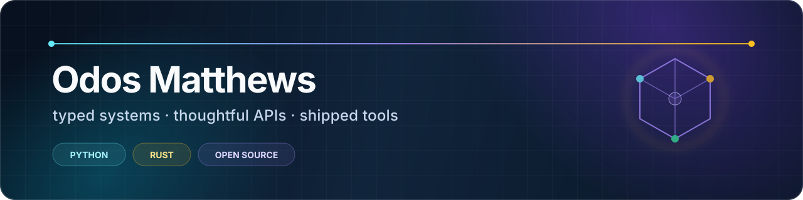

  

  
  
  
  
  

I design and ship open-source developer tools where **strong types**, **fast runtimes**, and **clear product thinking** meet. My work spans Python and Rust data systems, embedded databases, semantic-web tooling, server-rendered UI, and learning infrastructure.

The through-line is simple: take a complicated system, give it an API that feels inevitable, document the tradeoffs honestly, and ship the whole product—not just the interesting algorithm.

## Flagship work

<table>
  <tr>
    <td width="50%" valign="top">
      <h3>🧩 <a href="https://github.com/eddiethedean/hedron">Hedron</a></h3>
      
Typed Python components for FastAPI and HTMX. Build dashboards, admin tools, and CRUD apps without adopting a JavaScript application stack.

      
PYTHON · FASTAPI · HTMX · PYDANTIC

      
<a href="https://hedron.readthedocs.io/en/latest/">Documentation →</a>

    </td>
    <td width="50%" valign="top">
      <h3>🦉 <a href="https://github.com/eddiethedean/strixonomy">Strixonomy</a></h3>
      
A VS Code environment for browsing, editing, querying, reasoning over, and validating OWL, RDF, and OBO ontologies.

      
RUST · TYPESCRIPT · LSP · SEMANTIC WEB

      
<a href="https://marketplace.visualstudio.com/items?itemName=strixonomy.strixonomy">VS Code Marketplace →</a>

    </td>
  </tr>
  <tr>
    <td width="50%" valign="top">
      <h3>🗄️ <a href="https://github.com/eddiethedean/modelvault">ModelVault</a></h3>
      
A schema-first embedded database for Pydantic models and dataclasses, with validation, indexes, migrations, and single-file deployment.

      
RUST · PYTHON · PYDANTIC · PyO3

      
<a href="https://modelvault.readthedocs.io/en/latest/">Documentation →</a>

    </td>
    <td width="50%" valign="top">
      <h3>🎓 <a href="https://github.com/eddiethedean/lessonkit">LessonKit</a></h3>
      
A React-first framework for accessible, trackable learning experiences with telemetry, xAPI, SCORM, cmi5, and LMS packaging.

      
TYPESCRIPT · REACT · XAPI · SCORM

      
<a href="https://lessonkit.readthedocs.io/en/latest/">Documentation →</a>

    </td>
  </tr>
  <tr>
    <td width="50%" valign="top">
      <h3>🌊 <a href="https://github.com/eddiethedean/etlantic">ETLantic</a></h3>
      
One typed pipeline model with deterministic plans and pluggable execution across Python, Polars, Pandas, SQL, and PySpark.

      
PYTHON · DATA CONTRACTS · PIPELINES · PLUGINS

      
<a href="https://etlantic.readthedocs.io/">Documentation →</a>

    </td>
    <td width="50%" valign="top">
      <h3>⚡ <a href="https://github.com/eddiethedean/robin-sparkless">Sparkless</a></h3>
      
A PySpark-compatible DataFrame engine for fast local pipelines and JVM-free unit tests, powered by Rust and Polars.

      
RUST · PYTHON · POLARS · PYSPARK API

      
<a href="https://robin-sparkless.readthedocs.io/">Documentation →</a>

    </td>
  </tr>
</table>

## The systems beneath the surface

| Project | Role in the portfolio |
| --- | --- |
| [**PydanTable**](https://github.com/eddiethedean/pydantable) | Strongly typed DataFrames combining Pydantic schemas with a Rust execution engine |
| [**Moltres**](https://github.com/eddiethedean/moltres) | DataFrame-style SQL with pushdown execution, CRUD operations, and async support |
| [**Oxiland**](https://github.com/eddiethedean/oxiland) | Embedded RDF datasets, SPARQL, persistence, and streaming I/O for Rust and Python |
| [**PolarPandas**](https://github.com/eddiethedean/polarpandas) | A pandas-compatible interface backed by Polars for faster local analytics |

## How I build

- **Types are product design.** Good schemas and interfaces make the correct path the easy path.
- **Documentation is part of the runtime.** Quickstarts, decision guides, migration notes, and explicit limitations all ship with the code.
- **Interoperability beats lock-in.** I build bridges across Python, Rust, SQL, Spark, Polars, Pydantic, web frameworks, and open standards.
- **A release is the unit of progress.** Packages, wheels, crates, extensions, examples, CI, and upgrade paths turn experiments into usable tools.

## Find the right starting point

- Building Python dashboards or internal tools? Start with [**Hedron**](https://github.com/eddiethedean/hedron).
- Testing PySpark logic without waiting on the JVM? Try [**Sparkless**](https://github.com/eddiethedean/robin-sparkless).
- Storing typed application models locally? Explore [**ModelVault**](https://github.com/eddiethedean/modelvault).
- Authoring learning experiences in React? Use [**LessonKit**](https://github.com/eddiethedean/lessonkit).
- Working with ontologies in VS Code? Install [**Strixonomy**](https://marketplace.visualstudio.com/items?itemName=strixonomy.strixonomy).

  <strong>Build the abstractions you wish existed.</strong> 
  For project-specific questions or collaboration, open an issue or discussion in the relevant repository.

